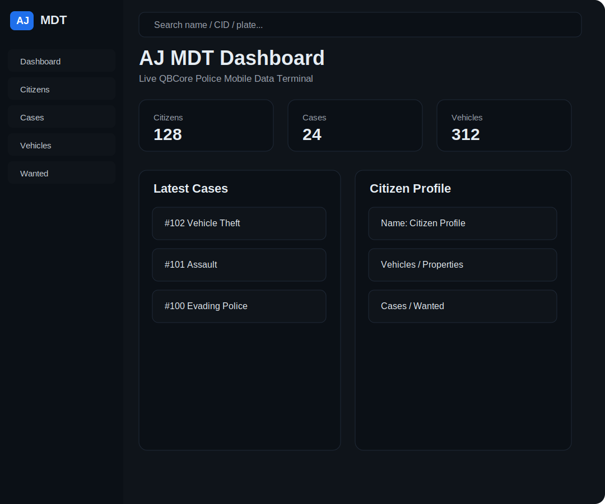

# AJ MDT

AJ MDT is a QBCore Police MDT resource for FiveM with Arabic and English NUI support.

## Preview



## Features

- Arabic / English interface
- NUI size: 1080x900
- Police-only access
- Citizens management from QBCore `players`
- Full citizen profile
- Citizen vehicles from `player_vehicles`
- Citizen properties from `player_houses` or `apartments`
- Cases management
- Wanted list management
- Flagged vehicles system
- Violations and cases guide
- Dashboard with live statistics
- Prepared page for suspicious bank transactions

## Requirements

- qb-core
- oxmysql
- QBCore database tables:
  - `players`
  - `player_vehicles`
  - optional: `player_houses`
  - optional: `apartments`

## Installation

1. Put the resource folder in your server resources directory.
2. Import the SQL file:

```sql
sql/aj_mdt.sql
```

3. Add this to your server.cfg:

```cfg
ensure aj_mdt
```

4. Make sure `qb-core` and `oxmysql` start before this resource.

## Command

```text
/mdt
```

Only configured police jobs can open the MDT.

## Configuration

Edit `config.lua`:

```lua
Config.Locale = 'ar' -- ar / en

Config.PoliceJobs = {
    ['police'] = true
}
```

You can add more police jobs:

```lua
Config.PoliceJobs = {
    ['police'] = true,
    ['sheriff'] = true,
    ['state'] = true
}
```

## Database

The resource creates these MDT tables:

- `aj_mdt_cases`
- `aj_mdt_wanted`
- `aj_mdt_vehicle_flags`
- `aj_mdt_laws`

Citizen and vehicle data are read from QBCore tables instead of being duplicated.

## Notes

The suspicious bank transactions page is prepared for future integration. Send the bank table name and columns to connect it.
